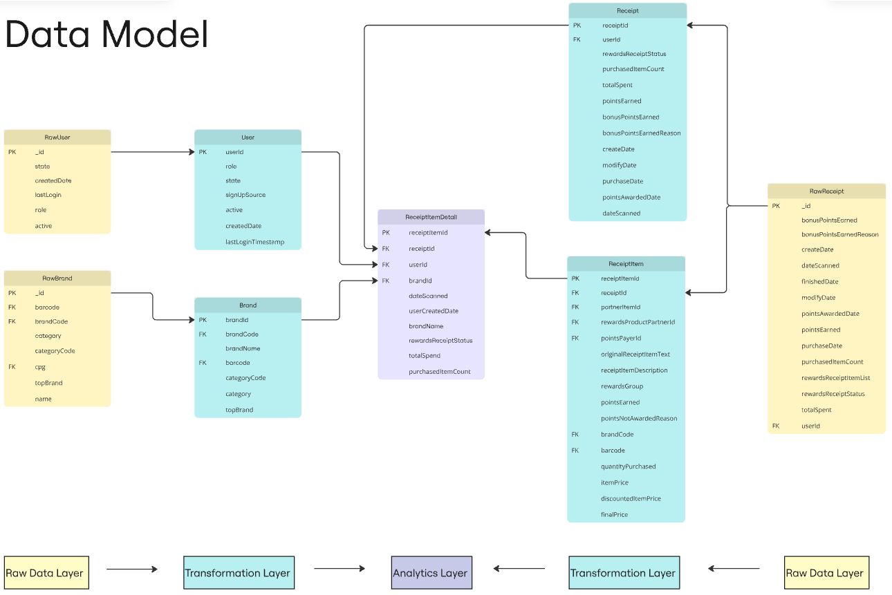

# Fetch Rewards Analytics Engineering Challenge Documentation

## Overview
This repository contains my solution to the Fetch Rewards Analytics Engineering coding challenge. The challenge involves analyzing receipt, user, and brand data to derive business insights and address data quality concerns. I primarily used Google Cloug Platform (GCP) BigQuery (BQ) SQL and even set up a dummy project in GCP. 

### Tools and Technologies Used
- SQL Dialect: GCP BigQuery SQL
- Python
- GitHub

### Data Sources
The analysis uses three raw JSON data sources (from a MongoDB source):
1. **Receipts Data**: Contains transaction information including points earned, items purchased, and receipt status
2. **Users Data**: Contains user account information and activity status
3. **Brands Data**: Contains brand and product categorization information

### Initial Observations
Before exploring the data, I created a Python script to process each json file to a BQ SQL-friendly format.  This primarily involved flattening the the MongoDB objects (I had to do a lot of research here as I was unfamiliar with MongoDB json formats) and then updating the files to be in a new line delimited JSON format.  This is contained in the process_json.py script:
```python
import json

# Func to flatten MongoDB objects but preserve arrays for BigQuery
def flatten_mongo_object(obj, prefix=''):
    if isinstance(obj, dict):
        new_obj = {}
        for key, value in obj.items():
            if isinstance(value, dict):
                if "$date" in value:
                    new_obj[key] = value["$date"]
                elif "$oid" in value:
                    new_obj[key] = value["$oid"]
                elif "$ref" in value and "$id" in value:
                    if isinstance(value["$id"], dict) and "$oid" in value["$id"]:
                        new_obj[key] = value["$id"]["$oid"]
                    else:
                        new_obj[key] = value["$id"]
                else:
                    # Handle nested objects
                    nested_obj = flatten_mongo_object(value)
                    # If nested object is a dict, flatten with dot notation
                    if isinstance(nested_obj, dict):
                        for nested_key, nested_value in nested_obj.items():
                            new_obj[f"{key}.{nested_key}"] = nested_value
                    else:
                        new_obj[key] = nested_obj
            elif isinstance(value, list):
                # Keep arrays as arrays, but flatten their contents
                new_obj[key] = [flatten_mongo_object(item) for item in value]
            else:
                new_obj[key] = value
        return new_obj
    elif isinstance(obj, list):
        return [flatten_mongo_object(item) for item in obj]
    return obj

# Func to process each json file and parse them properly for BigQuery
def process_json_file(filename):
    # Read all lines and parse each line as JSON
    with open(filename, 'r') as file:
        objects = []
        for line in file:
            if line.strip():
                obj = json.loads(line)
                flattened_obj = flatten_mongo_object(obj)
                objects.append(flattened_obj)
    
    # Write each object on a new line
    output_filename = filename.replace('.json', '_processed.json')
    with open(output_filename, 'w') as file:
        for obj in objects:
            json_line = json.dumps(obj)
            file.write(json_line + '\n')
    
    print(f"Created {output_filename} with {len(objects)} objects")

# Parse files
process_json_file('brands.json')
process_json_file('receipts.json')
process_json_file('users.json')
```

Methods used to explore the data:
- Built-in table explorer feature in BQ (new feature which is really cool!)  Here is an example screenshot of that feature:


- Simple SQL aggregations to look for duplicates and unique field values.  Here are a couple examples:
```sql
select
  _id
  , count(*)
from `fetch-analytics-proj.Staging.RawUser`
group by 1 having count(*) > 1
order by 2 desc
```


```sql
select
  role
  , count(*)
from `fetch-analytics-proj.Staging.RawUser`
group by 1
order by 2 desc
```


Once the processed json files were imported to tables in BQ, these were my observations:

- Date/time fields are in a unix milliseconds format which I will transform to iso
- There may be duplicates in the User table (to be investigated later on)
- Receipt and Brand tables are unique on _id field.
- User fields:
  - User.role field also has 'fetch-staff' as a potential value though the schema for the project specifies that this field is a: 'constant value set to "CONSUMER"'
- Brand fields: 
  - name is better populated than brandCode
  - Similarly, category is better populated than categoryCode
  - barcode has a few dupes but the _id field is unique, so this may be expected
  - topBrand is a bool, but has a lot of NULLs, will likely transform NULLs to FALSE
- Receipt fields:
  - There are a lot of NULL purchasedItemCount records which is unexpected on first glance
  - Similarly, a lot of NULL pointsEarned values, but maybe not all purchases result in earning reward points
  - There are also a lot of NULL totalSpent records, given these are receipt entries, I would expect something was purchased
  - bonusPointsEarnedReason field values are not very explanatory, would need more info from Stakeholders here
  - rewardsReceiptItemList is a nested array field and likely should be in it's own table to be useful for analytics
    - several nested bool fields that have NULLs

    
## 1. Data Model
I created a strucutred relational data model using Miro. The model shows the relationship between the raw data through the simple transformation layer I created to a final dataset that will be used for analytics to answer the stakeholder's questions.



### Key Tables and Relationships
- The User, Brand, and Receipt tables are fairly straightforward.
  - Date/Timestamp fields were transformed to an iso format.
  - Minor field renaming, most notably the _id fields were renamed to add clarity between the datasets.
  - A few fields were not exposed as they were not necessary for analytics (currently) or they were not very supportive dimensionally for the datasets with my limited knowledge of the data.
- ReceiptItem was created from the nested array field, rewardsReceiptItemList, in the RawReceipt table.
  - The unique id for the table was created by taking the receiptId and appending an incrementing integer for each item associated with the receipt record.
- ReceiptItemDetail is the only analytics table exposed in the model.
  - This table functions as a fact table at the most granular data level (receiptItemId) and joins the four transformation tables to access all necessary data fields for analysis.
- The data model allows us to consider and analyze all stakeholder questions.

### Data Tranformation Layer
I tranformed the raw data tables in order to parse date/time fields into a useable format, unnest arrays, remove duplicates, rename primary key fields, etc. I tried to keep renaming of fields to a minimum so that's easy to follow along.

All transformation and the final analytics layer scripts are in the production_data folder.
- production_data 
  - Brand.sql
  - Receipt.sql
  - ReceiptItem.sql
  - ReceiptItemDetail.sql
  - User.sql

## 2. Analysis Queries

The following SQL queries address the business stakeholder questions and are located in the repo here:
- production_data
  - 1and2_Top5BrandRecentAndPreviousMonth.sql
  - 3and4_AvgSpendItemsPurchasedReceiptStatus.sql
  - 5and6_BrandWithMostSpendAndTransactionsAmongNewUsers.sql

### Query 1: What are the top 5 brands by receipts scanned for most recent month?
```sql
-- Insert SQL query here
```
**Explanation**: [Explain approach and findings]

### Query 2: How does the ranking of the top 5 brands by receipts scanned for the recent month compare to the ranking for the previous month?
```sql
-- Insert SQL query here
```
**Explanation**: [Explain approach and findings]

### Query 3: When considering average spend from receipts with 'rewardsReceiptStatus’ of ‘Accepted’ or ‘Rejected’, which is greater?
```sql
-- Insert SQL query here
```
**Explanation**: [Explain approach and findings]

### Query 4: When considering total number of items purchased from receipts with 'rewardsReceiptStatus’ of ‘Accepted’ or ‘Rejected’, which is greater?
```sql
-- Insert SQL query here
```
**Explanation**: [Explain approach and findings]

### Query 5: Which brand has the most spend among users who were created within the past 6 months?
```sql
-- Insert SQL query here
```
**Explanation**: [Explain approach and findings]

### Query 6: Which brand has the most transactions among users who were created within the past 6 months?
```sql
-- Insert SQL query here
```
**Explanation**: [Explain approach and findings]


## 3. Data Quality Assessment
### Identified Issues

All data quality SQL script examples are included in the data_quality folder.

- Data Completeness
  - Many data fields are fairly incomplete and have a significant amount or majority of NULL values. Some of these seem particularly problematic (like a receipt having not having a purchasedItemCount/totalSpent). Here are some examples:
    - Brand.categoryCode
    - Receipt.purchasedItemCount
    - User.lastLoginTimestamp
- Data Uniqueness
  - The raw users table contains many pure duplicates idenitifiable with the following query (user_duplicates.sql). After removing these, there are no remaining user duplicates (like a userId with 2 different roles for example). These were removed from the User table during data transformation.
  - There are a handful of barcodes with different brandCodes which seems incorrect. Given I do not know the full context of the data, I did not remove these.
  
- Inconsistent Values & Data Types
  - The barcodes field in the Brand dataset is integer, but in the receipt item data, the barcodes are a string data type and have some non-integer characters.
  - Several boolean fields have NULLs. Generally NULLs should be treated as FALSE. It will be risky to filter against these fields if there are NULLs.
  - The brandCode contains string values, NULLs, and '' empty strings.  Mixing nulls and empty strings is not good practice, it should be one or the other (preferrably NULLs) because this makes it much harder to filter against this field properly.
- Unexpected Data Values
  - 
- Other Checks Considered
  - Data freshness
    - Not relevant as this sample dataset is historical (Data from 2021 are the most recent)
  - Statistical Anomalies
    - Given that the sample size of this dataset is rather small, it is not relevant (and likely misleading) to check for any statistical outliers
  - Referential Integrity
    - Checking for orphaned records is not relevant here as each dataset has it's own primary key


## 4. Questions and Assumptions
- To do: Document any assumptions made
- To do: List questions that arose during analysis

### Performance Considerations
- To do: Document any indexing strategies
- To do: Explain partitioning decisions if applicable
- To do: Note any potential scaling concerns

## Future Improvements
- To do: Document any potential enhancements
- To do: Note areas for optimization